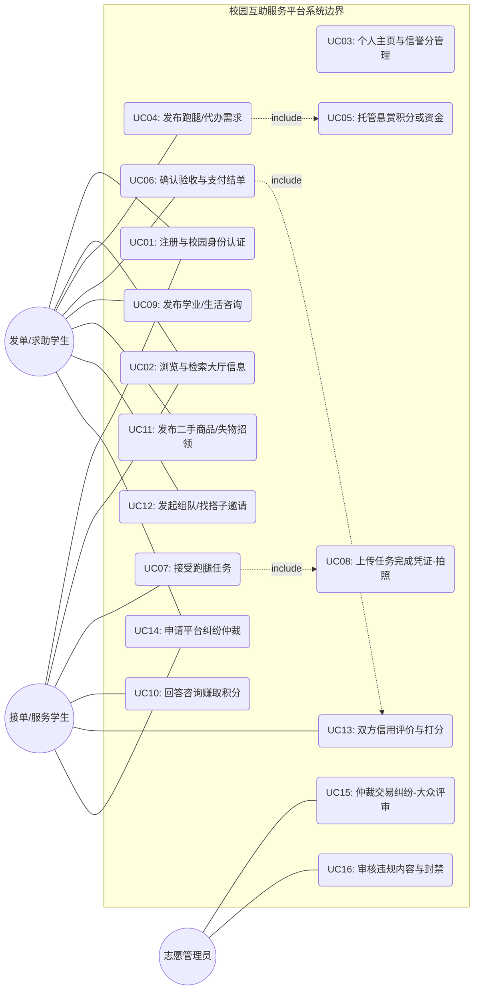

# 3.1 系统级用例图

```mermaid
graph LR
    %% 参与者定义 (Actors)
    UserA((发单/求助学生))
    UserB((接单/服务学生))
    Admin((志愿管理员))

subgraph 校园互助服务平台系统边界
    %% 基础模块
    UC01(UC01: 注册与校园身份认证)
    UC02(UC02: 浏览与检索大厅信息)
    UC03(UC03: 个人主页与信誉分管理)

    %% 核心交易模块
    UC04(UC04: 发布跑腿/代办需求)
    UC05(UC05: 托管悬赏积分或资金)
    UC06(UC06: 确认验收与支付结单)
    UC07(UC07: 接受跑腿任务)
    UC08(UC08: 上传任务完成凭证-拍照)

    %% 社区互动模块
    UC09(UC09: 发布学业/生活咨询)
    UC10(UC10: 回答咨询赚取积分)
    UC11(UC11: 发布二手商品/失物招领)
    UC12(UC12: 发起组队/找搭子邀请)

    %% 评价与维权模块
    UC13(UC13: 双方信用评价与打分)
    UC14(UC14: 申请平台纠纷仲裁)
    UC15(UC15: 仲裁交易纠纷-大众评审)
    UC16(UC16: 审核违规内容与封禁)

    %% 包含/扩展关系
    UC04 -.->|include| UC05
    UC07 -.->|include| UC08
    UC06 -.->|include| UC13
end

%% 发单学生关联
UserA --- UC01
UserA --- UC02
UserA --- UC04
UserA --- UC06
UserA --- UC09
UserA --- UC11
UserA --- UC12
UserA --- UC14

%% 接单学生关联
UserB --- UC01
UserB --- UC02
UserB --- UC07
UserB --- UC10
UserB --- UC13
UserB --- UC14

%% 管理员关联
Admin --- UC15
Admin --- UC16
```